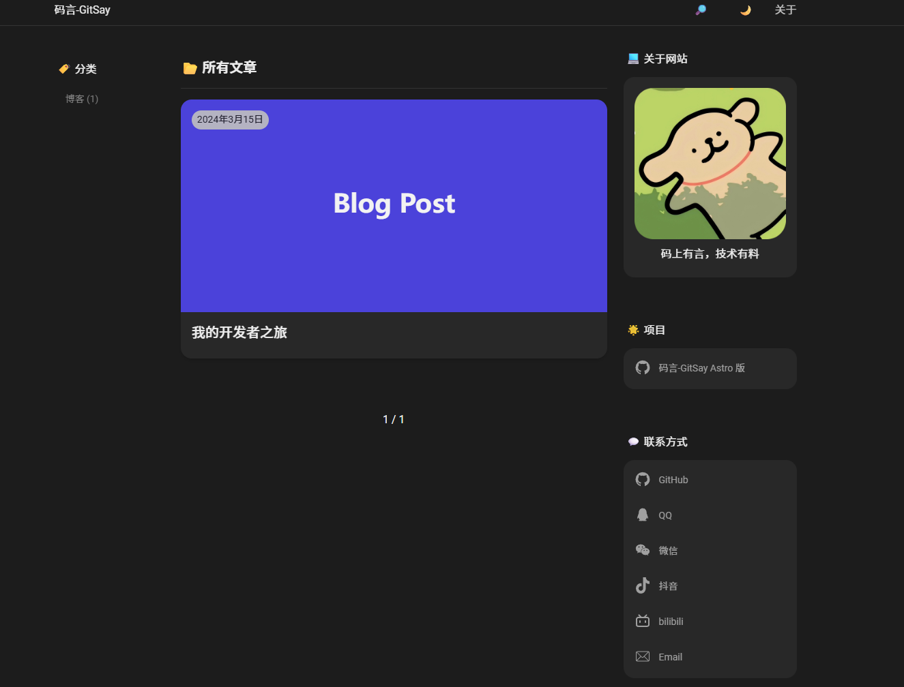

# 码言-GitSay-码上有言，技术有料

一个基于 Astro 构建的现代化、高性能的博客。针对中文环境深度定制，响应式设计，开箱即用。

🌐 **[在线演示](https://www.gitsay.com/)**



> **致谢**
> 本项目基于 **[morethan-log-astro](https://github.com/JustSereja/morethan-log-astro)** 进行二次开发。感谢原作者 [JustSereja](https://github.com/JustSereja) 提供的优秀基础。

## 🚀 特性

- **⚡️ 极速体验** - 基于 Astro 构建，性能卓越
- **📱 响应式设计** - 完美适配桌面端和移动端
- **🌙 深色模式** - 支持自动切换和手动切换深色/浅色主题
- **🔍 全局搜索** - 内置强大的文章搜索功能
- **📝 Markdown 支持** - 支持 Markdown/MDX 编写文章，完整语法高亮
- **🏷️ 分类管理** - 支持博客、技术、项目等多种分类
- **📊 SEO 友好** - 内置 Sitemap、RSS 订阅和详细的 Meta 标签配置
- **⚙️ 高度可配置** - 通过单一配置文件轻松自定义
- **💬 社交链接** - 集成微信、QQ、Bilibili、抖音等国内主流社交媒体

## 📦 快速开始

### 环境要求

- Node.js 18+ 和 npm

### 安装

1. **克隆仓库**
   
   ```bash
   git clone https://github.com/gbmomo/GitSay-Astro.git
   cd GitSay-Astro
   npm install
   ```

2. **使用 GitHub 模板**（可选）
   
   [](https://github.com/gbmomo/GitSay-Astro/generate)

### 启动开发服务器

```bash
npm run dev
```

访问 `http://localhost:4321` 即可预览博客！

> `npm run dev` 会自动处理所有客户端包——无需额外的监视命令。编辑 `src/` 下的文件，Astro 开发服务器会自动处理。

## ⚙️ 配置

核心配置位于 `src/config/site.ts`，区域元数据位于 `src/config/locales.ts`。两个文件都有完整的 TypeScript 类型支持。

### 站点设置 (`src/config/site.ts`)

```typescript
import type { SiteConfig } from '@config';

const siteConfig: SiteConfig = {
  siteUrl: 'https://www.gitsay.com',
  title: {
    zh: '码言-GitSay',
  },
  description: {
    zh: '码上有言，技术有料',
  },
  author: {
    name: {
      zh: 'Goblin_MoMo',
    },
    email: 'S@gitsay.com',
    avatar: '/img/profile.png',
    bio: {
      zh: '以代码构筑技术世界，用游戏解锁快乐日常。',
    },
  },
  // ...完整选项请查看配置文件
};

export default siteConfig;
```

### 联系方式与社交链接

添加任意联系方式或社交账号：

```typescript
contactLinks: [
  {
    id: 'github',
    label: {
      zh: 'GitHub',
    },
    url: {
      zh: 'https://github.com/gbmomo',
    },
    iconSvg: '<svg>...</svg>',
  },
  {
    id: 'bilibili',
    label: {
      zh: 'bilibili',
    },
    url: 'https://b23.tv/j2UzkiK',
  },
];
```

### 分类配置

配置博客分类：

```typescript
categories: {
  blog: {
    enabled: true,
    path: '/blog',
    icon: '💻',
    label: {
      zh: '博客',
    },
    description: {
      zh: '个人想法、经验和见解',
    },
  },
  technology: {
    enabled: true,
    path: '/technology',
    icon: '🚀',
    label: {
      zh: '技术',
    },
    description: {
      zh: '深入探讨 Web 开发、工具和最佳实践',
    },
  },
  // 添加更多分类
}
```

### 功能开关

启用或禁用功能：

```typescript
features: {
  darkMode: true,
  search: true,
  rss: true,
  sitemap: true,
  imageLightbox: true,
  // ... 更多功能
}
```

## 📝 编写文章

### 创建新文章

1. 在相应目录下创建 `.md` 文件：
   - 博客文章：`src/content/posts/zh/blog/`
   - 技术文章：`src/content/posts/zh/technology/`
   - 项目展示：`src/content/posts/zh/projects/`

2. 添加 frontmatter：

```markdown
---
title: '你的文章标题'
h1: '显示标题'
description: '文章的简短描述'
date: '2026-01-08'
announcement: '可选的列表摘要'
image: '/img/posts/your-image.jpg'
permalink: 'my-custom-slug' # 可选：自定义 URL 路径
draft: false # 可选：设为 true 排除此文章
---

在这里写你的文章内容...
```

> 文件夹路径 `src/content/posts/<lang>/<category>/` 会自动决定语言和分类——无需额外的 frontmatter。

### Frontmatter 参考

| 字段 | 类型 | 描述 | 必填 | 默认值 |
| --- | --- | --- | --- | --- |
| `title` | `string` | 列表和 `<title>` 标签中显示的主标题 | ✅ | — |
| `h1` | `string` | 覆盖文章内的标题 | ❌ | 使用 `title` |
| `description` | `string` | SEO/meta 描述 | ❌ | — |
| `date` | `string` (ISO) | 发布日期，用于排序 | ✅ | — |
| `announcement` | `string` | 卡片上显示的简短摘要 | ❌ | — |
| `image` | `string` | 特色图片路径或 URL | ❌ | 分类/全局默认 |
| `permalink` | `string` | 自定义文章 URL（单个路径段） | ❌ | 从文件名派生 |
| `draft` | `boolean` | 从生产构建、订阅源、搜索和站点地图中排除 | ❌ | `false` |

### MDX 与交互式组件

- 文章和页面可以使用 `.mdx` 文件编写——相同的 frontmatter 架构适用。
- React 岛屿组件位于 `src/components/islands/**`。
- 在 MDX 中使用时，附加常规指令（`<DemoCounter client:load initial={3} />`），Astro 会在 React 接管之前流式传输静态 HTML。

### RSS 订阅

模板提供 RSS 订阅支持：

- **主订阅源** (`/rss.xml`) - 包含所有文章

每个 RSS 订阅源包括：
- ✅ 完整 HTML 内容（不仅仅是描述）
- ✅ 正确转换的图片 URL（相对路径转绝对路径）
- ✅ 作者信息
- ✅ 文章分类
- ✅ 所有必需的 RSS 2.0 元素

## 🎨 自定义

### 样式

- 主要样式：`public/css/style.css`
- 修改 CSS 变量来自定义颜色和主题
- 已包含深色模式样式

### 图片

#### 占位图片

模板为没有特色图片的文章提供分类特定的占位图片：

- **博客文章**：`/public/img/posts/placeholder-blog.svg`
- **技术文章**：`/public/img/posts/placeholder-technology.svg`
- **项目文章**：`/public/img/posts/placeholder-projects.svg`
- **默认**：`/public/img/posts/placeholder.svg`

文章会根据其分类自动使用相应的占位图片。

## 🚀 部署

### 构建生产版本

```bash
npm run build
```

构建流程包含一个后处理步骤，用于格式化输出并复制 `dist/404.html` 到 `dist/404/index.html`。这确保了需要目录样式 404 路由的服务商（如 GitHub Pages、Netlify）能够正确提供你的 404 页面。

### 预览生产版本

```bash
npm run preview
```

## 🛠️ 技术栈

- **Astro 5.0+**
- **React 19**
- **TypeScript**

## 📄 许可证

本项目的**源代码**遵循 [MIT 许可证](LICENSE)。

本项目的**网站内容**（文章、图片等资源）遵循 [CC BY-NC-SA 4.0](https://creativecommons.org/licenses/by-nc-sa/4.0/) 协议。转载请注明出处，禁止用于商业目的。

## 🤝 贡献

欢迎贡献！请查看 [贡献指南](CONTRIBUTING.md) 了解详情。

## 📞 联系

- **Email**: S@gitsay.com
- **GitHub**: [@gbmomo](https://github.com/gbmomo)
